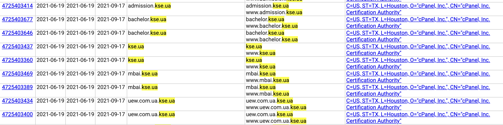

# Task3-4_CRYPTO


## 1

## 2

## 3

## 4

After tasks 1-3 we will get three special files:

- server.key (Our private key, which we must keep as secret 🤫)
- server.crt (Our certificate)
- server.csr (Request for certificate, inside which our public key is hidden) $\leftarrow$ Exactly what we will send to the other team.

## 5

In subtask 5 we need to sing our message «give my friend 2 bitcoins for a pizza» using the SHA-256 hash and also with RSA-PSS signature scheme.

$$\begin{aligned}
 \text{message} & \\
 \downarrow \text{   }& \text{ SHA-256}\\
 \text{bytes-message} & \\
 \downarrow \text{   }& \text{ RSA-PSS} \\
 \text{signature} & \\
\end{aligned}$$

First of all we substitute our message into `SHA256().hash` function and get hash in hex format so we transform it into bytes.
From our private key `server.key` we extract all private RSA params. Then we pull on public digits from private.
```commandline
n = public_numbers.n  # RSA modulus
e = public_numbers.e  # public exponent
d = private_numbers.d # private exponent
```
After that we use formula: `m^d mod n` where m is our bytes_message which was transformed into int.
For verification, we will use `s` (the resulting signature) public exponent `e` and `n`: `m' = s^e mod n` 
And If m and m' are not equals so somthing went wrong.

### Textbook RSA

Plain "textbook" RSA is not CPA-secure because it is deterministic: encrypting the same plaintext always yields the same ciphertext.
Also, textbook RSA it's a public-key encryption system. So it means that the attacker can know our public-key.
So attacker can easily attack textbook RSA.

1. Choose two distinct plaintext messages (say, A and B) and submit them to the challenger.
2. Receive an encrypted ciphertext c from the challenger.
3. Using the public key, encrypt A and B to obtain $c_A = E_{k_{pub}}(A) \text{ and } c_B = E_{k_{pub}}(B)$
4. Check which of $c_A$ and $c_B$ is equal to c. Since the encryption scheme is deterministic, one of them should be.

To make RSA secure against such attacks, we need to add padding with random bits before encryption. 
So after padding attacker will not get the same result again.

We see that **PKCS#v1.5** has many weaknesses such as:

- It is deterministic.
- The hashed value can be extracted from the signature.
- It has no formal security proof.

**RSA-PSS** can beat all these weaknesses. 

- It uses randomized signatures for the same message. (So it's rather probabilistic than deterministic)
- We also can't anymore extract hash, because random salt  was added.
- And it has a formal security proof of its security.


## 6

In subtask 6 we have the same message = «give my friend 2 bitcoins for a pizza». 

`key_data` hear is same text which place in `key.pub`, we use `serialization.load_pem_public_key` 
to translate ordinary text into the desired Python format that can be used for encryption.

```commandline
key_data = key_path.read_bytes()
public_key = serialization.load_pem_public_key(key_data)
```

After that we used special function `.encrypt()` and we pass on our message, and algorithm (hashes.SHA256()).

## 7

In subtask 7 we will use `crt.sh` service. We will look only in columns where Common Name = kse.ua.



But this service has to mach data. So we will use this command:

```bush
curl -s 'https://crt.sh/?Identity=kse.ua&output=json' \
| jq '
[
  .[]
  | select((.common_name // "" | ascii_downcase) == "kse.ua")
]
| sort_by(.not_before)
| .[0]
'
```

We use `jq` to read all information from the website, and add `&output=json` in the end of the link.
Then we search for columns Common Name = kse.ua, and sort them $\downarrow$ (.not_before) and took only 1 certificate.

*  "not_before": "2021-06-19T00:00:00",
*  "not_after": "2021-09-17T23:59:59",

For period, we need not_before ~~--~~ not_after. It's 90 days 23 hours 59 minutes and 59 seconds.

**In summary:**

* Fist certificate was issued: 2021-06-19 00:00:00
* It was valid until: 2021-09-17 23:59:59
* Period: 90 days 23 hours 59 minutes and 59 seconds

## 8

In subtask 8 we use the same formula but with `reverse` to bring up the latest, 
and with `> certificat_kse.json` to redirect output.

```bush
curl -s 'https://crt.sh/?Identity=kse.ua&output=json' \
| jq '
[
  .[]
(base) hanna@Mac Task3-4_CRYPTO % >....                                                                                                                           
]
| unique_by(.id)
| sort_by(.not_after)
| reverse
| .[0]
' > certificat_kse.json      
```


## Contribution

## Reference

1. <https://medium.com/@keithacrawfordjr/rsaprivatekey-encryption-in-python-7c78ec254ceb>
2. <https://crypto.stackexchange.com/questions/47512/why-plain-rsa-encryption-does-not-achieve-cpa-security>
3. <https://billatnapier.medium.com/provable-secure-signatures-with-rsa-8c1ca7d68433>
4. <https://cryptography.io/en/latest/hazmat/primitives/asymmetric/rsa/>
5. ...
